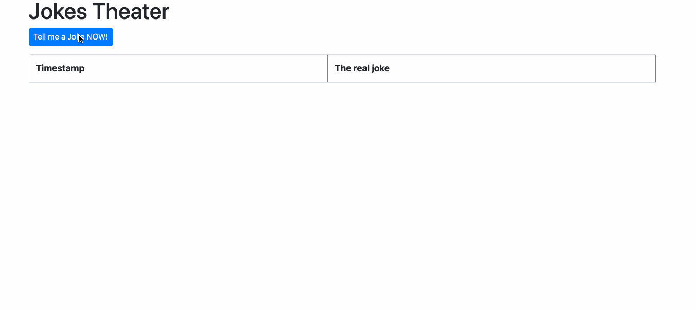

# apache-kafka-simple-demo 🃏

Java Spring-boot application that produce and consume messages in Apache Kafka.

➠ Everytime the button is clicked a new message is pushed to kafka topic.

➠ HTML table data is populated by reading the messages from that same kafka topic.

